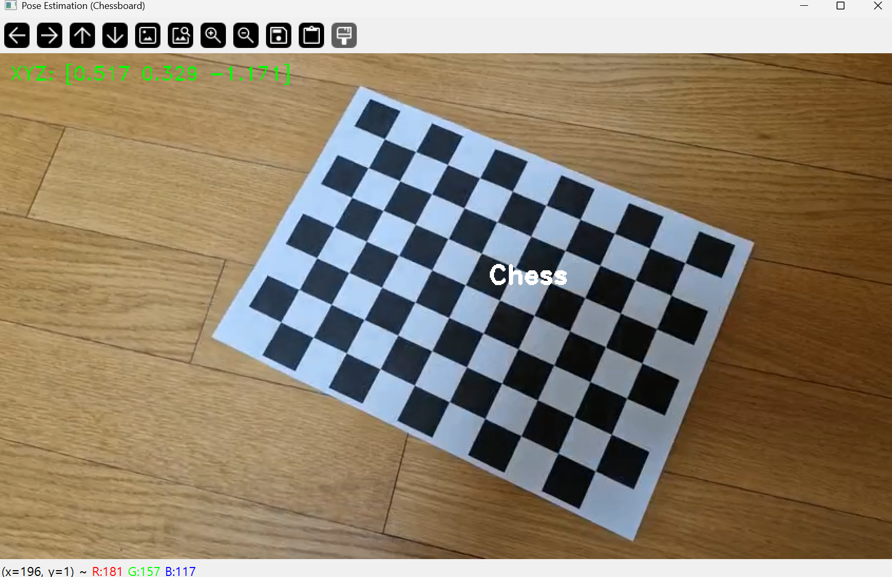
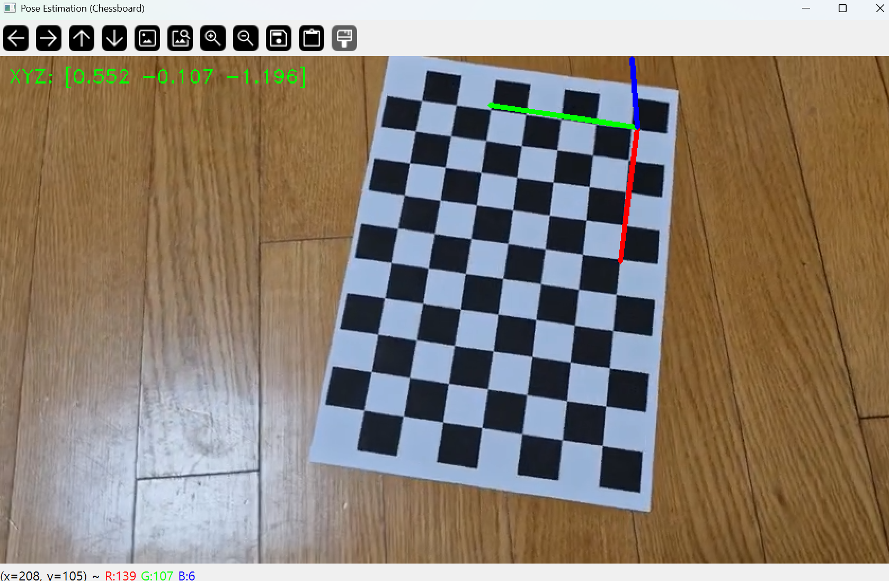

# PoseEstimationAR

Camera pose estimation using chessboard with AR text and axis visualization in OpenCV

# 주요 기능

휴대폰 카메라로 chessboard image를 촬영한 chessboard_sample.mp4 video와 camera calibration을 진행하여 얻은 calibration_result.npz 파일을 사용

Chessboard-based World Coordinate System 설정

solvePnP()를 사용하여 각 프레임에서 카메라의 pose 추정

solvePnP()로 얻은 rvec, tvec을 역변환하여 사용

현재 프레임에서 카메라의 위치를 추정한 XYZ 좌표를 좌측 상단에 표시

camera pose estimation의 결과값을 사용하여 AR 오브젝트를 chessboard 위에 표시

"Chess" text 가 지정된 위치에 표시

주석 처리를 수정하면 XYZ 축 표시 가능

## Key

- Space : 일시정지
- ESC : 종료

# 결과

## text AR

text의 위치 좌표 (x, y, z) = (5, 3, -1.5)

## XYZ axis AR

axis의 위치는 원점 사용

- Red : X
- Green : Y
- Blue : Z
